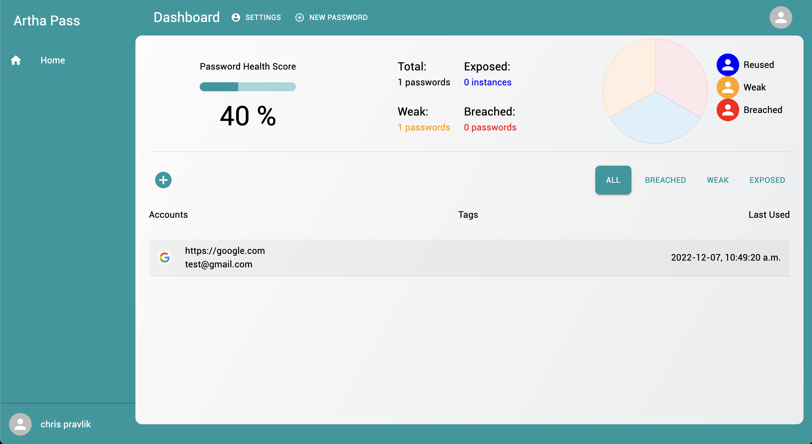
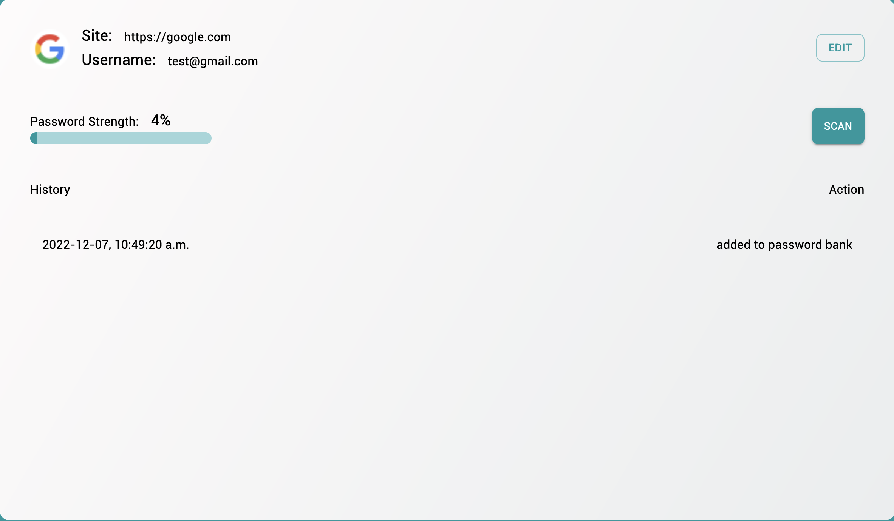

# Artha Pass 🔑

A school project written in react and express aimed at creating a password manager that monitors whether accounts
inside the password bank have been breached by cross checking with enzoic API.




## Deployment 🚧

Clone the project

```bash
  git clone https://github.com/Exsius/ArthaPass
```

Go to the project directory

```bash
  cd ArthaPass
```

Start the server

```bash
  docker-compose up
```
## Environment Variables ✏️

To run this project, you will need to add the following environment variables to your .env file

`SESSION_SECRET`
`TOKEN_SECRET`
`REFRESH_TOKEN_SECRET`
`ENZOIC_SECRET`
`DB_HOST`
`DB_USER`
`DB_PASSWORD`
`DB_ROOT_PASSWORD`
`DB_NAME`
`DB_PORT`
`REDIS_HOST`
`REDIS_PORT`
`REDIS_USER`
`REDIS_PASSWORD`

## Third party tools 🔨

 - [enzoic](https://www.enzoic.com/apis/)
 
## Authors 🎓

- [@Exsius](https://www.github.com/exsius)
- [@TraXanh13](https://www.github.com/TraXanh13)

